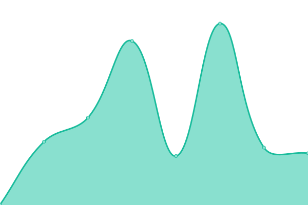

# [📈 Live Status](https://timvazquez-mlt.github.io/shieldmark-upptime): <!--live status--> **🟩 All systems operational**

This repository contains the open-source uptime monitor and status page for [timvazquez-mlt](https://timvazquez-mlt.github.io/shieldmark-upptime), powered by [Upptime](https://github.com/upptime/upptime).

With [Upptime](https://upptime.js.org), you can get your own unlimited and free uptime monitor and status page, powered entirely by a GitHub repository. We use [Issues](https://github.com/timvazquez-mlt/shieldmark-upptime/issues) as incident reports, [Actions](https://github.com/timvazquez-mlt/shieldmark-upptime/actions) as uptime monitors, and [Pages](https://timvazquez-mlt.github.io/shieldmark-upptime) for the status page.

<!--start: status pages-->
<!-- This summary is generated by Upptime (https://github.com/upptime/upptime) -->
<!-- Do not edit this manually, your changes will be overwritten -->
<!-- prettier-ignore -->
| URL | Status | History | Response Time | Uptime |
| --- | ------ | ------- | ------------- | ------ |
|  [ShieldMark](https://shieldmark.us/wp-admin/) | 🟩 Up | [shield-mark.yml](https://github.com/timvazquez-mlt/shieldmark-upptime/commits/HEAD/history/shield-mark.yml) | 

 995ms
     
 | 

<a href="https://timvazquez-mlt.github.io/shieldmark-upptime/history/shield-mark">100.00%</a>
    

|  [Mighty Line Tape](https://mightylinetape.com/) | 🟩 Up | [mighty-line-tape.yml](https://github.com/timvazquez-mlt/shieldmark-upptime/commits/HEAD/history/mighty-line-tape.yml) | 

 315ms
     
 | 

<a href="https://timvazquez-mlt.github.io/shieldmark-upptime/history/mighty-line-tape">100.00%</a>
    

|  [Floor Tape](https://floortape.com/) | 🟩 Up | [floor-tape.yml](https://github.com/timvazquez-mlt/shieldmark-upptime/commits/HEAD/history/floor-tape.yml) | 

 1060ms
     
 | 

<a href="https://timvazquez-mlt.github.io/shieldmark-upptime/history/floor-tape">100.00%</a>
    

|  [Floor Sign](https://floorsign.com/) | 🟩 Up | [floor-sign.yml](https://github.com/timvazquez-mlt/shieldmark-upptime/commits/HEAD/history/floor-sign.yml) | 

 2742ms
     
 | 

<a href="https://timvazquez-mlt.github.io/shieldmark-upptime/history/floor-sign">100.00%</a>
    

<!--end: status pages-->

[**Visit our status website →**](https://timvazquez-mlt.github.io/shieldmark-upptime)

## 📄 License

- Powered by: [Upptime](https://github.com/upptime/upptime)
- Code: [MIT](./LICENSE) © [Anand Chowdhary](https://anandchowdhary.com), supported by [Pabio](https://pabio.com)
- Data in the `./history` directory: [Open Database License](https://opendatacommons.org/licenses/odbl/1-0/)
